# Documentação Técnica – Projeto Final da Trilha de Engenharia de Dados  
## ETL Automatizado – Dados de Funcionários (IBM HR Analytics)

---

## 1. Introdução
Este projeto implementa um **pipeline de ETL (Extract, Transform, Load)** totalmente automatizado, utilizando **Apache Airflow** para orquestração.  
O objetivo é processar dados de RH relacionados ao turnover (saída de funcionários), permitindo que a empresa fictícia **Data Girls S.A** realize análises e tome decisões estratégicas.  
O dataset utilizado é o **IBM HR Analytics Attrition & Performance**, que contém informações de funcionários, cargos, desempenho e satisfação.

## 2. Arquitetura do Pipeline

### Visão Geral
- **Extração** – Download automático do dataset via **Kaggle API**.  
- **Transformação** – Limpeza, tratamento e separação das tabelas por domínio.  
- **Carga** – Armazenamento dos dados tratados no **Amazon S3** e no **MySQL**.  
- **Automação** – Orquestração via **Airflow**, com agendamento diário.  

### Diagrama Simplificado

Kaggle → Airflow (Extract) → Pandas (Transform) → S3/MySQL (Load)

### Tecnologias Utilizadas
- **Apache Airflow** – Orquestração  
- **Python 3.12 + Pandas** – Transformação de dados  
- **Boto3** – Integração com AWS S3  
- **SQLAlchemy + PyMySQL** – Integração com MySQL  
- **Kaggle API** – Extração de dados  
- **AWS S3** – Armazenamento de arquivos Parquet/CSV  
- **MySQL** – Armazenamento tabular  

### Como executar

#### Pré-requisitos
- **Python 3.12** Não usar 3.13+, pois algumas libs não suportam.
- **Kaggle API KEY** configurada dentro da pasta /kaggle/kaggle.json
- **Conta AWS** com credenciais (`AWS_ACCESS_KEY_ID`, `AWS_SECRET_ACCESS_KEY`, `REGION_NAME`, `BUCKET`)

#### Clonar o repositório
```bash
https://github.com/CeciliaPerles/ReStart-Data-Girls.git
cd ReStart-Data-Girls
```
#### Popular o /kaggle/kaggle.json
{"username":"{seu_kaggle_user}","key":"{seu_kaggle_key}"}

#### Popular o .env 
##### Api Kaggle
- KAGGLE_USERNAME=[seu_user_kaggle]
- KAGGLE_KEY=[sua_key_kaggle]

##### AWS
- AWS_ACCESS_KEY_ID=[seu_access_key_id]
- AWS_SECRET_ACCESS_KEY=[seu_access_key_id]
- REGION_NAME=[região do seu bucket na S3]
- BUCKET=[nome do seu bucket na S3]

#### Rodar o Docker dentro da pasta airflow
```bash
docker compose up
```
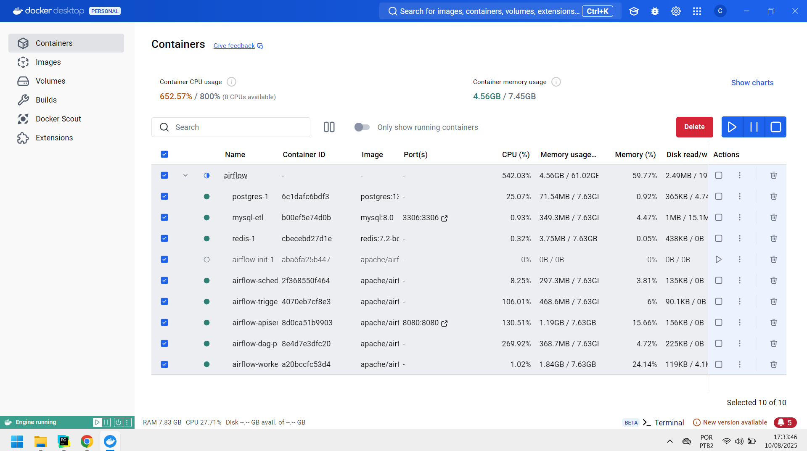

## 3. Estrutura de Pastas

A organização do projeto segue uma estrutura que separa claramente as responsabilidades de cada módulo:

```text
BootcampReStart/
├── .venv/                     # Ambiente virtual Python
├── airflow/                   # Configuração e execução do Airflow
│   ├── config/                 # Configurações adicionais
│   ├── dags/
│   │   └── dag_etl.py          # Definição da DAG principal do ETL
│   ├── logs/                   # Logs de execução do Airflow
│   ├── plugins/                # Plugins personalizados (se necessário)
│   ├── .env                    # Variáveis de ambiente específicas do Airflow
│   └── docker-compose.yaml     # Configuração do Airflow e serviços no Docker
├── dashboard/                  # Arquivos relacionados a dashboards (ex.: Power BI)
├── kaggle/                     # Credenciais ou scripts relacionados ao Kaggle
├── project/                    # (Reservado para artefatos ou dados do projeto)
├── src/                        # Código-fonte do pipeline
│   ├── extract/                # Scripts de extração de dados (Kaggle API)
│   ├── load/                   # Scripts de carga (S3, MySQL, etc.)
│   ├── transform/              # Scripts de transformação e limpeza
│   └── utils/                  # Funções utilitárias (ex.: conexão, logging, validações)
├── main.py                     # Script principal (execução direta, se aplicável)
├── pipeline.log                 # Log geral do pipeline
├── requirements.txt            # Dependências do projeto
├── .env                        # Variáveis de ambiente do projeto
└── .gitignore                  # Arquivos/pastas a serem ignorados no Git
```

## 4. Fluxo da DAG no Airflow

| Task ID     | Descrição              |
|-------------|------------------------|
| `run_main`  | Executa o fluxo de ETL |

**Agendamento:**  
A DAG está configurada para rodar diariamente às **6h da manhã**.
```bash
schedule="0 6 * * *"
```
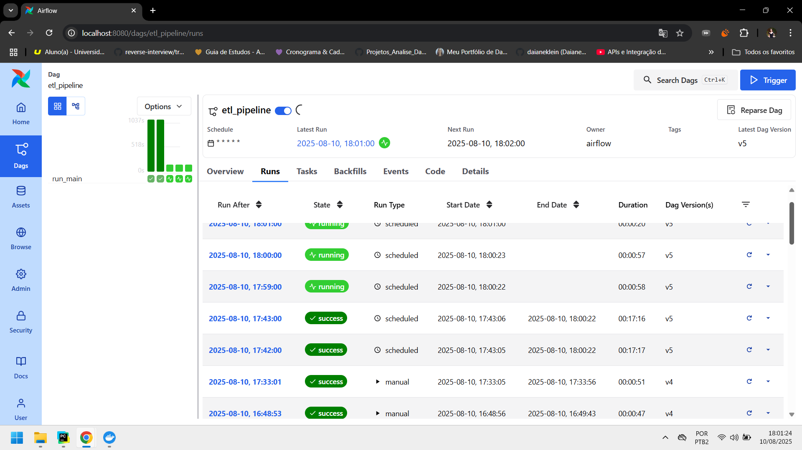

## 5. Estrutura dos Dados

### Tabelas no MySQL

#### dados_pessoais
- idade  
- genero  
- estado_civil  
- escolaridade  
- area_de_formacao  
- distancia_de_casa  
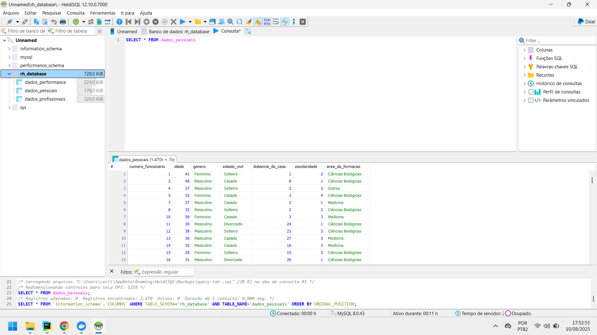

#### dados_profissionais
- departamento  
- cargo  
- nivel_do_cargo  
- anos_na_empresa  
- anos_no_cargo_atual  
- anos_desde_ultima_promocao  
- anos_com_mesmo_gerente  
- horas_extras  
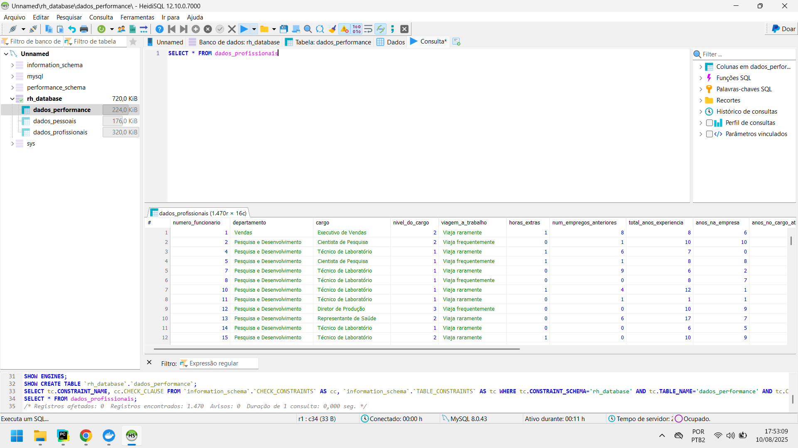

#### dados_performance
- renda_mensal  
- avaliacao_de_desempenho  
- aumento_percentual_salario  
- satisfacao_com_ambiente  
- satisfacao_no_trabalho  
- satisfacao_com_relacoes  
- engajamento_no_trabalho
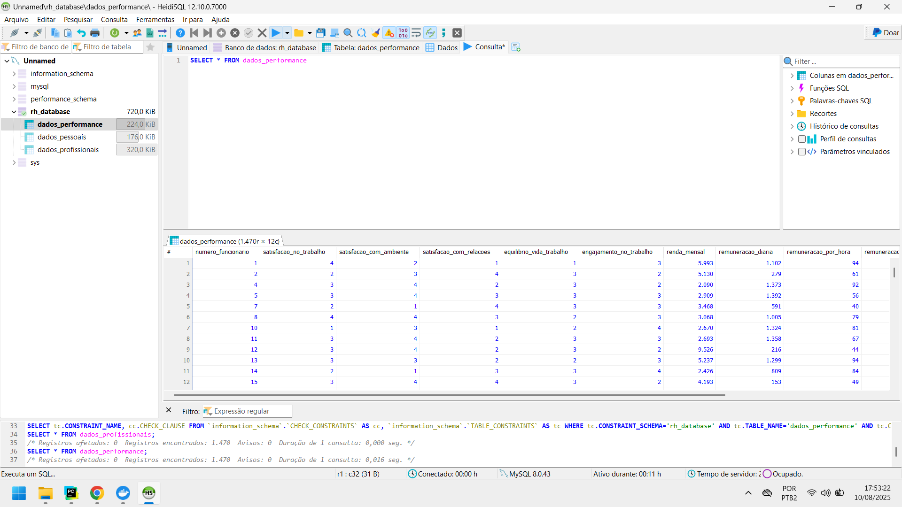

## 6. Transformações realizadas

##### `rename_columns_snake_case(df)`
- **Objetivo:** Padronizar os nomes das colunas para o formato `snake_case`.
- **Motivo:** Evitar problemas de compatibilidade com bibliotecas Python e facilitar leitura e manipulação.
- **Impacto:** Colunas consistentes para joins, filtros e exportações.
---
##### `convert_to_binary(df, col_name, is_abbreviated)` / `convert_columns_to_binary(df)`
- **Objetivo:** Converter valores binários textuais (`Yes/No` ou `Y/N`) para `1/0`.
- **Motivo:** Permitir análises numéricas e cálculos estatísticos sem conversões adicionais.
- **Impacto:** Facilita correlação, agregações e uso em modelos estatísticos ou de machine learning.
---
##### `translate_categorical_columns(df)`
- **Objetivo:** Traduzir valores de colunas categóricas do inglês para o português.
- **Motivo:** Tornar os dados mais claros e compreensíveis para usuários finais e relatórios.
- **Impacto:** Dashboards e análises mais legíveis, mantendo o significado de negócio.
##### `extract_domain_dataframes(df)`
- **Objetivo:** Separar o DataFrame original em três domínios: `dados_pessoais`, `dados_profissionais` e `dados_performance`.
- **Motivo:** Organizar dados por contexto para facilitar análise e armazenamento.
- **Impacto:** Reduz complexidade das tabelas, melhora performance e clareza na modelagem.
##### `rename_columns_ptbr(dict_df)`
- **Objetivo:** Alterar nomes técnicos de colunas para termos em português.
- **Motivo:** Usar nomenclatura alinhada ao negócio e aos usuários de relatórios.
- **Impacto:** Facilita entendimento em análises e relatórios sem necessidade de dicionário de dados.
---
##### Escrita em Parquet e envio ao S3 (`put_df_s3`)
- **Objetivo:** Salvar os DataFrames em formato Parquet e enviar para o Amazon S3.
- **Motivo:** Usar formato colunar eficiente, comprimido e otimizado para leitura.
- **Impacto:** Reduz custo de armazenamento e acelera consultas.
---
##### Particionamento por data (`transform/YYYY-MM-DD/`)
- **Objetivo:** Armazenar arquivos organizados por data de processamento.
- **Motivo:** Permitir versionamento, auditoria e reprocessamento histórico.
- **Impacto:** Facilita governança e rastreabilidade do pipeline.
##### Logging e tratamento de exceções
- **Objetivo:** Registrar todas as ações e capturar erros durante as transformações.
- **Motivo:** Garantir observabilidade e facilitar depuração.
- **Impacto:** Permite identificar rapidamente falhas e agir preventivamente.

## 7. Armazenamento no S3

Os dados tratados são salvos no formato **Parquet** seguindo o padrão:

```text
s3://<BUCKET>/transform/YYYY-MM-DD/
|-- dados_pessoais.parquet
|-- dados_trabalho.parquet
|-- dados_desempenho.parquet
```
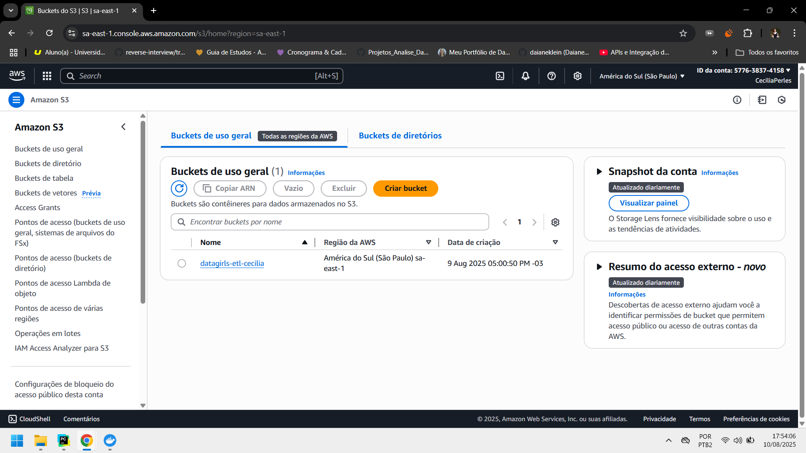
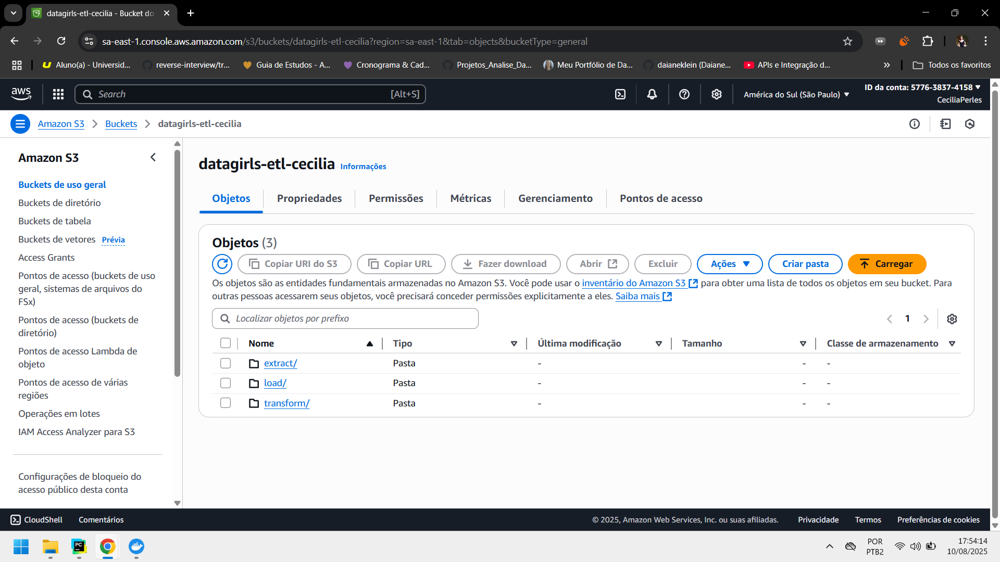
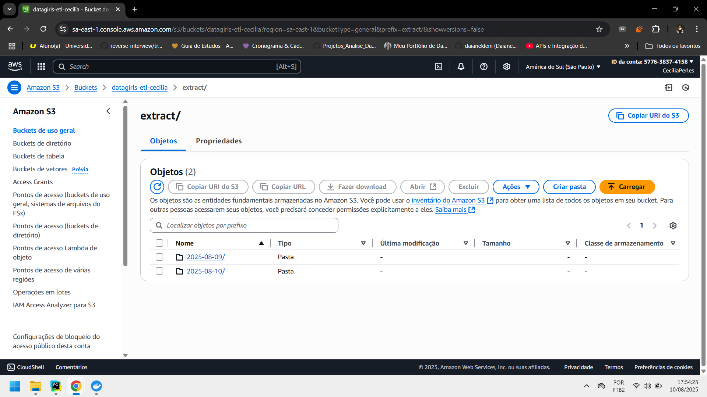
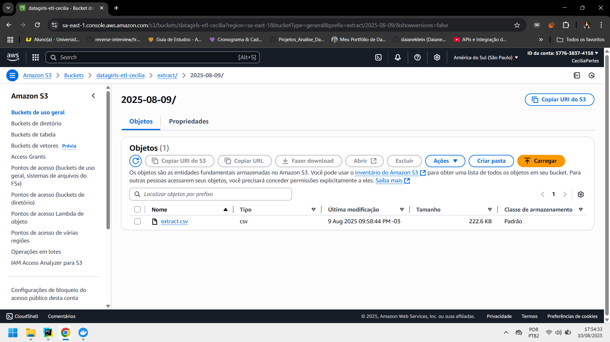

## 8. Dashboard
#### Dashboard desenvolvido no Power BI com base nos dados processados pelo pipeline de ETL.  
Ele fornece uma visão consolidada sobre engajamento, satisfação e perfil dos colaboradores.
---

### Página 1 — Visão Geral de Engajamento e Satisfação

**Principais KPIs:**
- **Funcionários Ativos:** Total de colaboradores registrados no período.
- **Percentual de Turnover:** Proporção de desligamentos em relação ao total de colaboradores.
- **Média de Satisfação no Trabalho:** Escala de 1 a 4, onde valores maiores indicam maior satisfação.
- **Percentual de Funcionários com Horas Extras:** Indicador de sobrecarga e engajamento.

**Gráficos:**
1. **Engajamento no Trabalho por Departamento:**  
   Comparação do engajamento médio entre RH, Pesquisa & Desenvolvimento (P&D) e Vendas.
2. **Engajamento no Trabalho por Gênero:**  
   Comparação entre colaboradores masculinos e femininos.
3. **Engajamento no Trabalho por Faixa Etária:**  
   Distribuição do engajamento médio por grupos de idade.
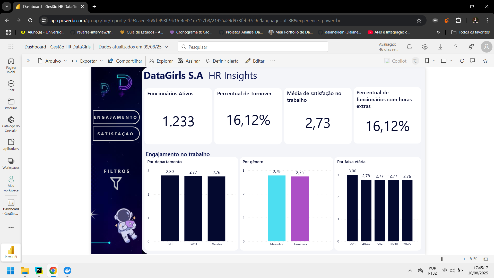

### Página 2 — Perfil e Satisfação dos Colaboradores
---
**Principais KPIs:**
- **Renda Mensal Média:** Média salarial dos colaboradores.
- **Proporção de Funcionários por Faixa Etária:** Distribuição etária da força de trabalho.
- **Proporção de Funcionários por Gênero:** Percentual de colaboradores masculinos e femininos.

**Gráficos:**
1. **Satisfação no Trabalho por Departamento:**  
   Avaliação média de satisfação para cada área.
2. **Satisfação no Trabalho por Gênero:**  
   Comparativo da satisfação média entre homens e mulheres.
3. **Satisfação no Trabalho por Faixa Etária:**  
   Análise da satisfação por diferentes grupos de idade.
---
### Objetivo
- **Monitorar indicadores de clima organizacional**
- **Identificar áreas e perfis com maior ou menor satisfação**
- **Auxiliar a gestão de RH na tomada de decisão**
- **Detectar padrões de engajamento e turnover**
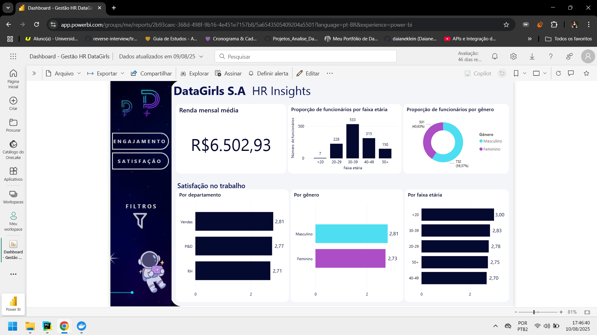
---

## 9. Perguntas Norteadoras

- **Como a empresa pode monitorar a rotatividade de funcionários semanalmente?**  
  Será criado um job no Airflow que, a cada dia, agregará e registrará os desligamentos (attrition) por período.  
  Isso permitirá identificar tendências e sazonalidades, apoiando decisões estratégicas de retenção.

- **Quais informações devem ser atualizadas em tempo real ou periodicamente?**  
  Os indicadores de turnover e engajamento serão processados diariamente no pipeline ETL, garantindo que o painel e as análises estejam sempre atualizados com os dados mais recentes.

- **Como garantir que os dados estejam prontos para análises de forma confiável?**  
  Durante a fase de transformação, serão aplicadas validações automáticas, incluindo:
  - Checagem de tipos de dados esperados (ex.: datas, números, textos).  
  - Tratamento de valores nulos e inconsistentes.  
  - Remoção de registros duplicados.  
  Isso assegura que as métricas geradas reflitam a realidade com precisão.

- **É possível criar um modelo incremental com essa base?**  
  O pipeline poderá armazenar a última data processada e, nas execuções seguintes, carregar apenas os registros novos.  
  Esse modelo reduz tempo de processamento e custo de armazenamento, mantendo eficiência mesmo com crescimento do volume de dados.